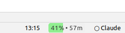
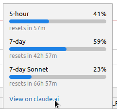

# Claude Usage IntelliJ Plugin

[](https://plugins.jetbrains.com/plugin/29946-claude-code-usage)

A simple IntelliJ plugin that displays your Claude subscription usage in the IDE status bar.

> **Note:** This plugin shows Claude subscription usage limits only (5-hour, 7-day quotas). It does not track API token usage, costs, or conversation history.



## Features

- Real-time usage percentage in the status bar with automatic refresh every minute (configurable)
- Manual refresh button in the popup for instant updates
- Color-coded progress indicator (green → yellow → red)
- Time until quota reset
- Detailed popup with all usage tiers (5-hour, 7-day, 7-day Sonnet, extra usage)
- Dark and light theme support
- Error state display with actionable hints (missing credentials, auth expired, network issues)
- Last fetch timestamp in the popup
- Configurable settings (Settings → Tools → Claude Code Usage):
  - Status bar quota display (5-hour, 7-day, or 7-day Sonnet)
  - Auto-refresh interval (1–60 minutes, default 1)
  - Warning color thresholds (yellow/red)
  - Custom credentials file path
  - Reset to defaults button
- Direct link to Claude settings



## Requirements

- IntelliJ IDEA 2024.1+ (works with all JetBrains IDEs: WebStorm, PyCharm, RubyMine, etc.)
- Claude Code CLI installed and authenticated

The plugin reads credentials from:

- **macOS:** the system Keychain entry `Claude Code-credentials` (where Claude Code CLI now stores them by default). On first run, macOS will show a one-time access dialog — click **Always Allow** for your IDE so the plugin can read the entry without further prompts. Falls back to `~/.claude/.credentials.json` if the keychain entry is missing.
- **Linux / Windows:** `~/.claude/.credentials.json` (created when you sign in to Claude Code CLI).

The credentials path and the macOS Keychain toggle are both configurable in **Settings -> Tools -> Claude Code Usage**.

> **Note (SSH):** the macOS Keychain is locked over SSH — same limitation as the official CLI. Either run `security unlock-keychain` first or fall back to the file path.

## Development

### Prerequisites

- JDK 17+
- Gradle 8.5+ (wrapper included)

### Build

```bash
./gradlew buildPlugin
```

Output: `build/distributions/claude-usage-intellij-plugin-x.x.x.zip`

### Run in sandbox IDE

```bash
./gradlew runIde
```

This launches a sandboxed IntelliJ instance with the plugin installed.

### Clean build

```bash
./gradlew clean buildPlugin
```

## Installation

### From JetBrains Marketplace (recommended)

1. In your IDE: Settings → Plugins → Marketplace
2. Search for "Claude Code Usage"
3. Click Install

Or install directly: [JetBrains Marketplace](https://plugins.jetbrains.com/plugin/29946-claude-code-usage)

### From source

1. Build the plugin: `./gradlew buildPlugin`
2. In your IDE: Settings → Plugins → ⚙️ → Install Plugin from Disk
3. Select `build/distributions/claude-usage-intellij-plugin-x.x.x.zip`
4. Restart the IDE

## Usage

Once installed, you'll see your usage in the status bar (bottom right). Click to see detailed breakdown of all quota tiers.

## Roadmap / Feature Ideas

- [ ] Usage history graph over time
- [ ] Export usage statistics

## Contributing

Contributions welcome! Please open an issue first to discuss proposed changes.

## License

MIT
